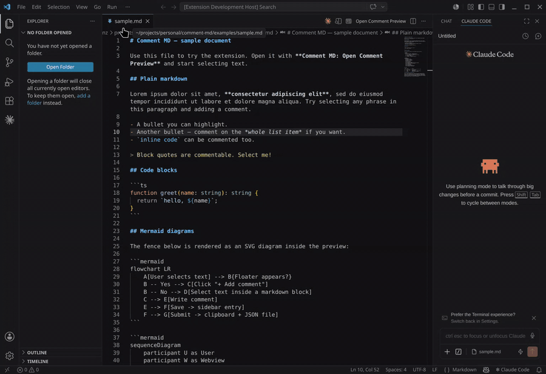

# Comment MD

A VSCode extension that opens Markdown files in a rich preview where you can attach **persistent comments** to any text selection. Mermaid diagrams are rendered inline. Comments live in a sidecar cache — the original `.md` file is never touched.

When you're done annotating, click **Submit** and your comments are bundled and handed off to an LLM chat (or simply copied to your clipboard, ready to paste anywhere).



---

## Features

- **Custom Markdown preview** with Mermaid diagrams (bundled — no companion extension required).
- **Select-to-comment**: highlight any text in the preview, click the floating **＋ Add comment** button, write a note, save.
- **Persistent comments**: stored in a workspace-local cache so they survive restarts and reloads. Your original `.md` is never modified.
- **Sidebar manager**: view, edit, delete, and jump-to every comment from a list sorted by source line.
- **Visual cue**: blocks with comments get a left-edge accent so you can see at a glance what has feedback.
- **One-click submit**: bundles all comments into a single batch, copies it to your clipboard, saves it to disk, and (optionally) drops an `@`-reference straight into your LLM chat.
- **Multiple entry points**: command palette, editor title bar, explorer right-click, editor right-click, or **"Reopen Editor With…"** picker.

---

## Install

Install **Comment MD** from the [VS Code Marketplace](https://marketplace.visualstudio.com/items?itemName=Fr4nz82.comment-md), or from inside VSCode:

1. Open the **Extensions** view (`Ctrl+Shift+X`).
2. Search for **Comment MD**.
3. Click **Install**.

No configuration is required — open any `.md` file and follow the steps below.

---

## How to open the preview

You have several entry points — pick whichever fits your flow.

### 1. Right-click a `.md` file in the Explorer
The file tree's context menu shows **Open Comment Preview**. Use this when you want to start a review without opening the raw markdown first.

### 2. Right-click inside an open `.md` editor
The editor's context menu has the same **Open Comment Preview** entry.

### 3. The editor title bar
Open a `.md` file → click the **Open Comment Preview** action in the top-right of the editor tab.

### 4. Command palette
`Ctrl+Shift+P` → **Comment MD: Open Comment Preview**.

### 5. "Reopen Editor With…" (replace text editor with the preview)
With a `.md` file open, run **View: Reopen Editor With…** (or right-click the tab) and choose **Comment MD Preview**. This swaps the text view for the preview in the same editor slot. To go back, use **Reopen Editor With… → Text Editor**.

> Tip: to make the preview the *default* opener for `.md`, run **Configure Default Editor for '\*.md'…** and pick **Comment MD Preview**.

---

## Workflow

1. **Open the preview** with any of the methods above.
2. **Select text** in the preview pane. A floating **＋ Add comment** button appears anchored to the selection.
3. **Click it.** A modal opens with the selected snippet and a text area. Type your comment. `Ctrl+Enter` saves, `Esc` cancels.
4. Your comment appears in the right-hand **sidebar**, sorted by source line. The matching block in the preview gets a left-edge accent.
5. **Manage comments** from the sidebar: each card has *Go to* (scroll to the comment's block), *Edit*, and *Delete*.
6. **Submit** when you're ready — click the **Submit** button in the toolbar.
   - All your comments are bundled into a single batch, copied to your clipboard, and saved into `.comment-md-cache/` in your workspace.
   - If you also have the [Claude Code](https://marketplace.visualstudio.com/items?itemName=Anthropic.claude-code) extension installed, the batch is automatically inserted into the Claude chat as an `@`-reference. Just type your follow-up (e.g. *"reply to each comment"*) and press Enter — Claude reads the file and sees both a human-friendly summary and the raw data.
   - With any other chat extension (or none): paste from the clipboard, or open the saved submission file from the notification.
   - After a successful submit, the sidebar is cleared so you're ready for the next review. If you didn't mean to send yet, click **Undo** in the notification to bring the comments back.

---

## Storage

Comments are saved in a `.comment-md-cache/` folder inside your workspace. Each `.md` file gets its own cache file; the originals are never modified.

If your workspace is a git repo and you don't want review files committed, add this to your `.gitignore`:

```
.comment-md-cache/
```

(If you open a `.md` outside any workspace, comments are stored in VSCode's global storage instead.)

---

## Commands

All commands live under the **Comment MD** category in the Command Palette (`Ctrl+Shift+P`):

- **Open Comment Preview** — opens the preview for the active markdown file.
- **Submit All Comments** — runs the submit flow (only enabled while a Comment MD preview is focused).

---

## Keyboard shortcuts (inside the preview)

| Action            | Shortcut       |
|-------------------|----------------|
| Save comment      | `Ctrl+Enter`   |
| Cancel modal      | `Esc`          |

---

## Tips & limitations

- Comments are anchored to **whole paragraphs / list items / code blocks**, not to arbitrary character ranges. The exact selected text is still saved with the comment, so downstream tools can recover sub-paragraph spans.
- If you significantly restructure a Markdown file after commenting (moving or deleting blocks), anchors may drift. Use **Edit** / **Delete** in the sidebar to re-anchor manually.
- The preview refreshes automatically when the underlying file is saved.

---

## Development

Want to hack on Comment MD? Clone, install, compile, and launch the Extension Development Host:

```bash
git clone https://github.com/Fr4nZ82/comment-md.git
cd comment-md
npm install
npm run compile
```

In VSCode, open the cloned folder and press **F5** ("Run Extension"). A new Extension Development Host window launches with the extension loaded.

Produce a local `.vsix`:

```bash
npm run package
```

### Submission payload (for downstream consumers)

If you're building a tool that consumes Comment MD submissions, the JSON written to `.comment-md-cache/submission-<timestamp>.json` has this shape:

```json
{
  "file": "/path/to/source.md",
  "submittedAt": "2026-05-15T12:34:56.000Z",
  "comments": [
    {
      "file": "/path/to/source.md",
      "startLine": 12,
      "endLine": 14,
      "selectedText": "the exact highlighted snippet from the preview",
      "comment": "the note you wrote"
    }
  ]
}
```

`startLine` / `endLine` are **0-based** line numbers in the source markdown identifying the block(s) the selection started/ended in. `selectedText` is preserved verbatim so consumers can locate sub-paragraph spans even though line numbers are block-level.

Issues and contributions: <https://github.com/Fr4nZ82/comment-md/issues>.
