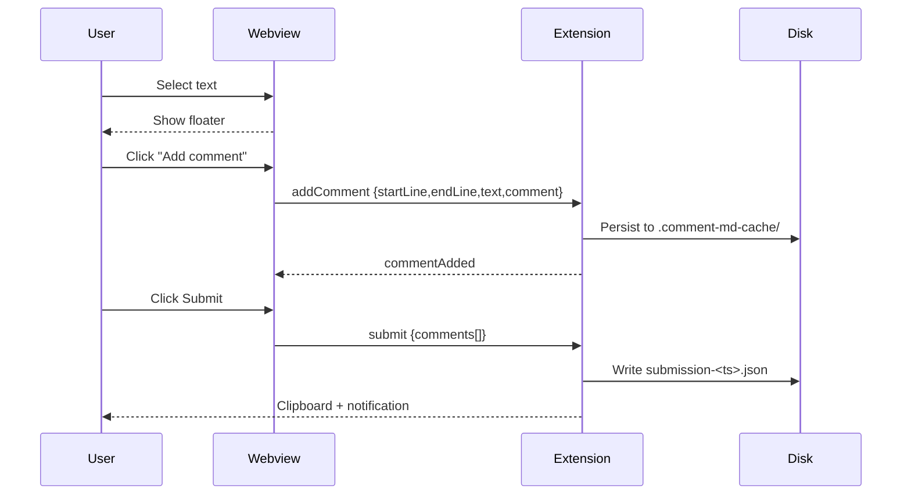

# Comment MD — sample document

Use this file to try the extension. Open it with **Comment MD: Open Comment Preview** and start selecting text.

## Plain markdown

Lorem ipsum dolor sit amet, **consectetur adipiscing elit**, sed do eiusmod tempor incididunt ut labore et dolore magna aliqua. Try selecting any phrase in this paragraph and adding a comment.

- A bullet you can highlight.
- Another bullet — comment on the *whole list item* if you want.
- `inline code` can be commented too.

> Block quotes are commentable. Select me!

## Code blocks

```ts
function greet(name: string): string {
  return `hello, ${name}`;
}
```

## Mermaid diagrams

The fence below is rendered as an SVG diagram inside the preview:

```mermaid
flowchart LR
    A[User selects text] --> B{Floater appears?}
    B -- Yes --> C[Click "+ Add comment"]
    B -- No --> D[Select text inside a markdown block]
    C --> E[Write comment]
    E --> F[Save -> sidebar entry]
    F --> G[Submit -> clipboard + JSON file]
```



## Tables

| Step | Action            | Result                         |
|------|-------------------|--------------------------------|
| 1    | Select text       | Floater appears                |
| 2    | Click "+ Add"     | Modal opens                    |
| 3    | Save              | Sidebar updates, cache written |
| 4    | Submit            | JSON copied to clipboard       |

## Long paragraph for stress testing

This is a longer paragraph used to verify that selections that span across multiple inline tokens are still correctly attributed to a single block-level source line. Try selecting from here, across **bold text**, through *italic*, and into `inline code` to confirm the selection still maps to this paragraph's start line. The literal text you highlighted is preserved verbatim in the JSON payload regardless of how it crosses inline boundaries.
